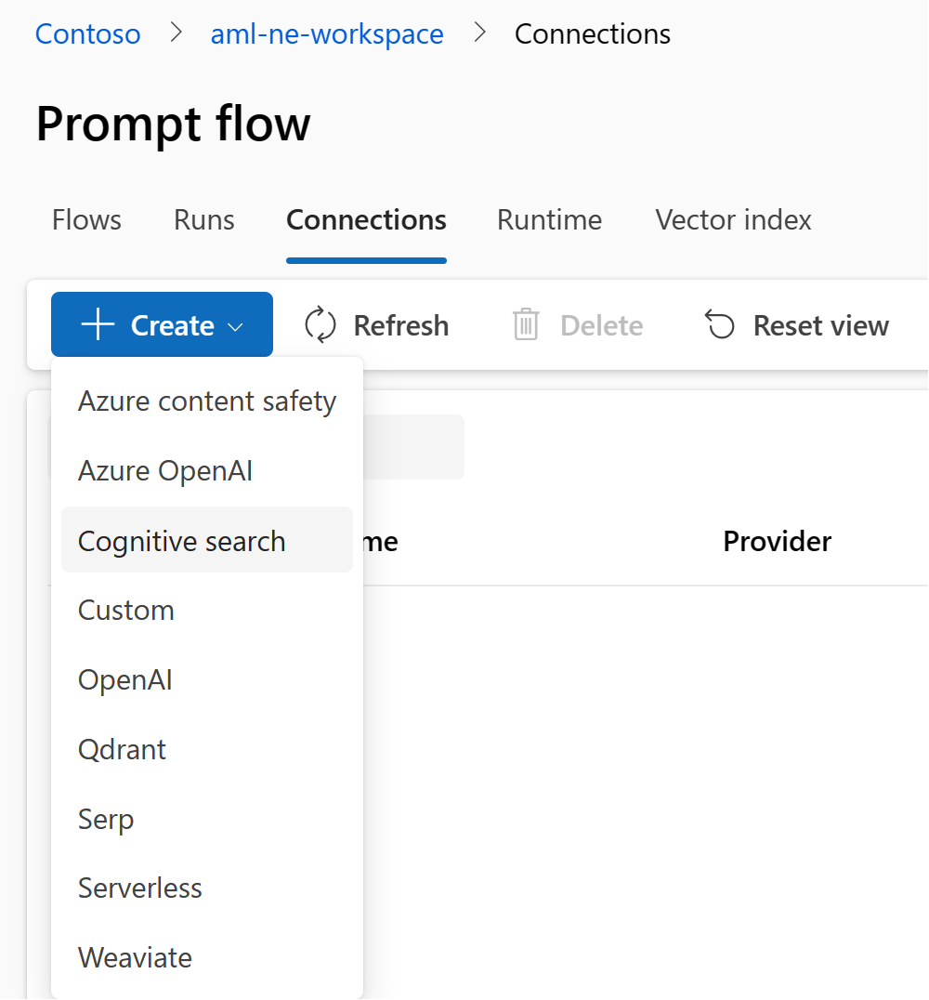
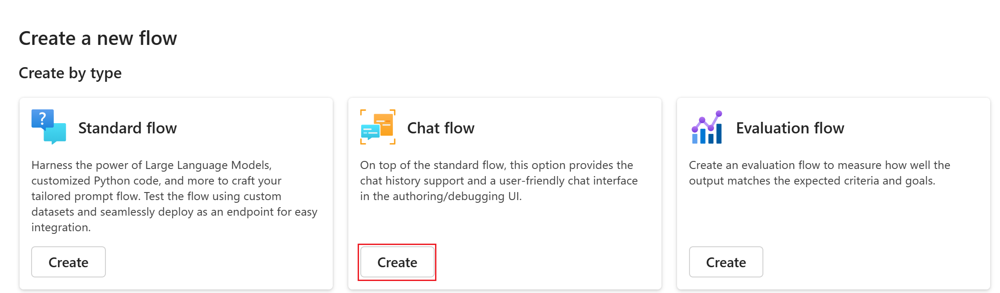
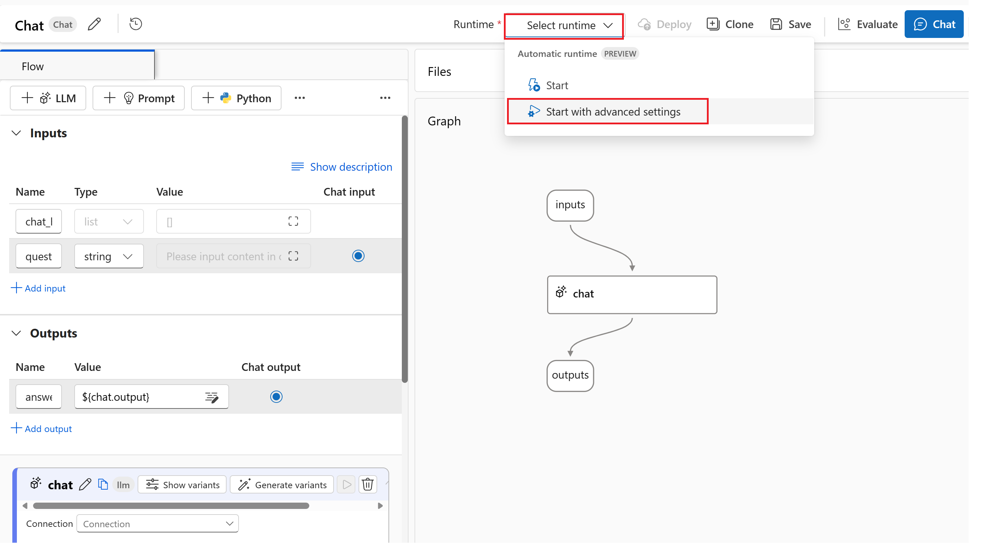
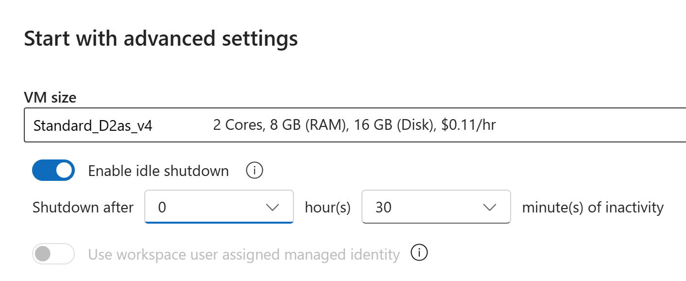
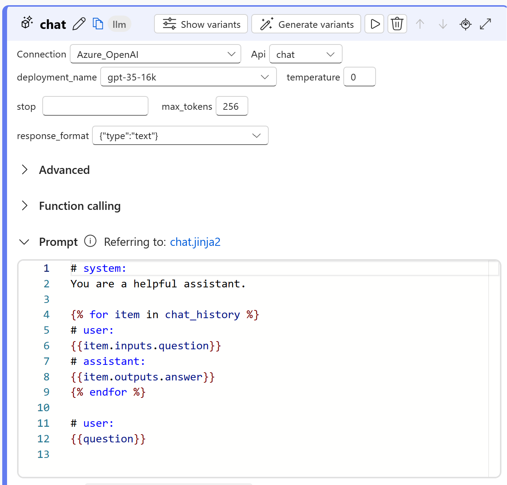
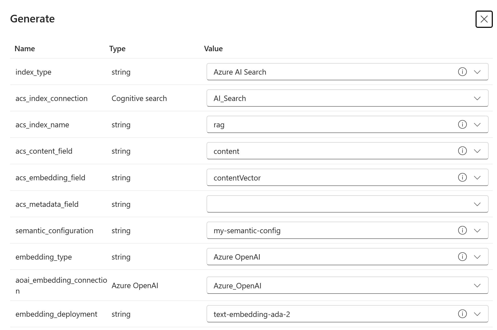
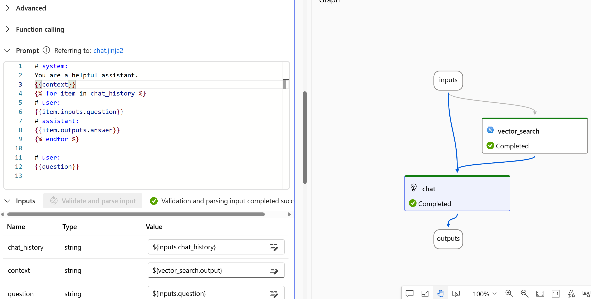

In this Lab we develop an application based on the RAG pattern using Azure Machine Learning Prompt Flow

# Requirements
- An Azure Machine Learning Studio resource.

# Preparation

## Azure Machine Learning Workspace
Create an Azure Machine Learning Studio Resource in your subscription. 
Follow the next steps to create an Azure Machine Learning workspace: 

The workspace is the top-level resource for your machine learning activities, providing a centralized place to view and manage the artifacts you create when you use Azure Machine Learning.

If you don't yet have a workspace, create one now:

Sign in to [Azure Machine Learning studio](https://ml.azure.com/)

Select Create workspace

Provide the following information to configure your new workspace:

**Workspace name**	Enter a unique name that identifies your workspace. Names must be unique across the resource group. Use a name that's easy to recall and to differentiate from workspaces created by others. The workspace name is case-insensitive.
**Subscription**	Select the Azure subscription that you want to use.
**Resource group**	Use an existing resource group in your subscription or enter a name to create a new resource group. A resource group holds related resources for an Azure solution. You need contributor or owner role to use an existing resource group. For more information about access, see Manage access to an Azure Machine Learning workspace.
**Region**	Select the Azure region closest to your users and the data resources to create your workspace.

Select Create to create the workspace

### Create a Connection for your Azure AI Search resource

Once your Azure Machine Learning workspace as been created go to the Prompflow within the **Authoring** section and create two new Connections, one for Azure AI Search and the other for Azure OpenAI. Both connections will be used later in the flow. 

Fill the different fields properly. For the Azure OpenAI connection ensure that the API version is **2024-02-01** which is the latest stable version.

### Create a Chat flow 

We have already created the two connections we are going to use in the flow. So the next step is to create a Chat flow. In the flows tab we select create and then Chat flos as the following image depects:

After a few minutes, our chat flow is created and then we need to start a new runtime. 

To create a new runtime click on the **Select runtime** and then on **Start with advanced settings** as the image shows. 

. Then we need to select the instance type which will be deployed and will contain all the required dependencies to run the promptflow. As an example, you could select the same instance type depuicted in the image, but any instance with at least 8 GB of memory would be enough.

After several minutes our new runtime is up and ready and we will see a green check in the Runtime selector. 

To check everything is working as expected we click on the chat box and then we select the Connection String we created in the previous step to use our Azure OpenAI Connection and then we select the Azure OpenAI deployment name we want to interact with. 

The following image shows an example of this configuration.

To check everything is ready to implement the RAG pattern we click on chat and we will ask anything to Azure OpenAI. If we get a response the setup is right. 

### Implementing a RAG pattern

Retrieval Augmented Generation (RAG) is an architecture that augments the capabilities of a Large Language Model (LLM) like ChatGPT by adding an information retrieval system that provides grounding data. Adding an information retrieval system gives you control over grounding data used by an LLM when it formulates a response. For an enterprise solution, RAG architecture means that you can constrain generative AI to your enterprise content sourced from vectorized documents and images, and other data formats if you have embedding models for that content.

The first step to create a RAG pattern is the embedding generation of the query. To do that we click on **More tools** and then we select the **Index Lookup** tool as the picture shows writing **vector_search** as the name of the node.

If we click on the first field, a new windows shows up and we need to fill properly. The next picture shows an example of the configuration of the vector DB: 

It is worth mentioning this configuration should be applied after creating the index using the notebook **RAG with Azure AI Search.ipynb**

Then we write in the **queries** field the value  ${inputs.question} and in the **query_type** we select Hybrid + semantic

Finally, we add a new variable to the system prompt in the chat node called **context** then we click on **Validate and parse input** button to check that the variable is properly added using the Jinja 2 text and we type ${vector_search.output} as the value of the field context. The final result should be similar to what is shown in the next image:

Finally, if we click on Chat button we could have a chat experience with our own data.